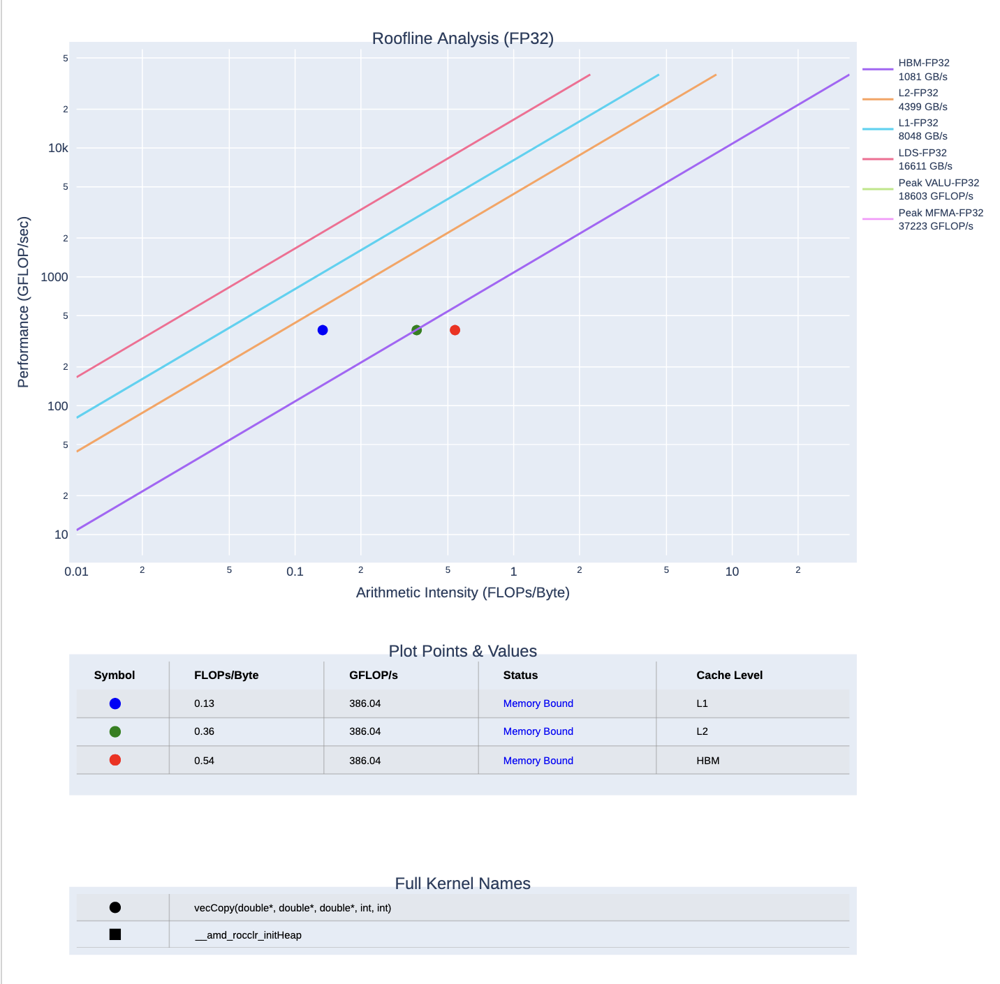
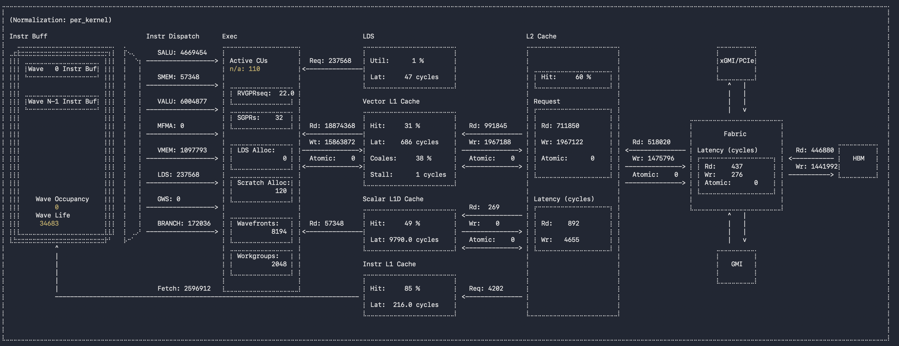
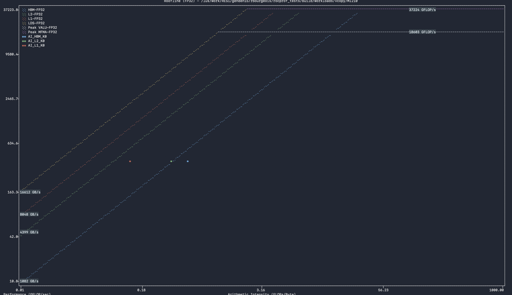

# Setting up rocprof-compute with rocm/7.2.0 on Adastra, March 2026

## Context

As of today, the official ROCm version to use on Adastra is 6.4.3 ([see the doc](https://dci.dci-gitlab.cines.fr/webextranet/other/changelogs.html#rocm-version-compatibility-with-cpe-25-09)), as later versions are not compatible with the Cray libraries. However, `rocprof-compute` and `rocprof-systems` are under active development, and releases earlier than `rocm/7.2.0` may be unstable.

This tutorial will help you to set up your environment:

- Create a module for `rocm/7.2.0`, which is available on Adastra but not exposed as a module, and load it.
- Set up a Python virtual environment with `rocprof-compute`'s dependencies.

So that you can run the latest `rocprof-compute`. It all seems very brittle at the moment, but we can expect a consolidation of the tools in the future.

[Link: latest rocprof-compute documentation](https://rocm.docs.amd.com/projects/rocprofiler-compute/en/latest/how-to/use.html)

**Note:** For working on your production code during the hackathon, you can use `rocprofv3` with `rocm/6.3.4`, which is stable. This tutorial is to get you prepared for the next generation of AMD profilers (`compute & systems`)

Clone this tutorial repository and checkout the correct branch:

```bash 
cd $WORK
git clone https://github.com/rbourgeois33/rocprof_tests.git
cd rocprof_tests
git checkout adastra-03-26
```

## Setting up the Environment

### Log into an accelerated node and fetch tutorial sources

This tutorial requires an interactive session on an Adastra MI250X node:

```bash
salloc --account=<your-account> --constraint=MI250 --job-name="rocprof_tutorial" --gpus-per-node=1 --cpus-per-task=12 --nodes=1 --time=1:00:00
```

Check your allocated node with `squeue --me`, then log into it (e.g. `ssh g1015`). Purge your modules, go to `$WORK`, and restrict visible devices to GPU 0:

```bash
module purge
cd $WORK/rocprof_tests
export HIP_VISIBLE_DEVICES="0"
```

### Create and load the rocm/7.2.0 module

`rocm/7.2.0` is not listed by `module avail rocm`, but it is present on the system (`ls /opt/rocm-7.2.0/`). A `.lua` module file is provided under `rocm/` in this project. Add and load it:

```bash
#In the root directory of rocprof_tests/
module use rocm/
module avail rocm
# rocm-7.2.0 should now be visible
module load rocm-7.2.0
```

Compile and run the HIP sample code (a modified version of [AMD's vcopy](https://github.com/ROCm/rocprofiler-compute/blob/amd-mainline/sample/vcopy.cpp) with FP32 operations) to verify the toolchain:

```bash
mkdir build
cd build
cmake .. -DCMAKE_BUILD_TYPE=Release -DCMAKE_TOOLCHAIN_FILE=../toolchains/adastra.mi250.7.2.0.cmake
make -j
./hip_sample -n 1048576 -b 256
```

Expected output:

```
hip_sample testing on GCD 0
Finished allocating vectors on the CPU
Finished allocating vectors on the GPU
Finished copying vectors to the GPU
Max grid size: 2147483647, Max block size: 1024
sw thinks it moved 1.000000 KB per wave 
Total threads: 1048576, Grid Size: 4096 block Size:256, Wavefronts:16384:
Launching the  kernel on the GPU
Finished executing kernel
Finished copying the output vector from the GPU to the CPU
Releasing GPU memory
Releasing CPU memory
```

### Set up `rocprof-compute`

Load python

```bash
module load python
python3 --version
# should be Python 3.12.1
```

Launching `rocprof-compute` without setup will fail due to missing python packages. Install them in a local virtual environment under `$WORK` to avoid exhausting your inode quota:

```bash
#In e.g. the root directory of rocprof_tests/
python3 -m venv ./venv_rocprof_compute
source ./venv_rocprof_compute/bin/activate
pip3 install -r requirements.txt
#fixed from /lus/home/softs/rocm/7.2.0/libexec/rocprofiler-compute/requirements.txt that breaks for here for some reasons... needs more investigation
```

Run `rocprof-compute` to verify no packages are missing.

On future sessions, simply re-source the environment:
```bash
module purge
cd $WORK/rocprof_tests
export HIP_VISIBLE_DEVICES="0"
module use rocm/
module load rocm-7.2.0
source ./venv_rocprof_compute/bin/activate
```

## Profiling

### profile mode
With everything in place, profile the application. The profiler replays the application ~13 times to collect all metrics, then benchmarks the GPU to measure it's actual peak performance (this can take a while). If `HIP_VISIBLE_DEVICES` is not set to `0`, all 8 GPUs of the node will be benchmarked (or probably GPU0 will be profiled 8 times), so again make sure you do `export HIP_VISIBLE_DEVICES="0"`

```bash
#In build/
rocprof-compute profile --name hip_sample -- ./hip_sample -n 1048576 -b 256
#it stalls for a while but will finish eventually
```

Results are saved under `workloads/`, including a PDF roofline plot:
 

On subsequent runs, the GPU benchmark is skipped as long as the `workloads/` folder exists.

### analyze mode

You can then look at several sections of the profile directly in the terminal, e.g. the memory workload analysis:

```bash
rocprof-compute analyze -p workloads/hip_sample/MI210/ -b 3
```

@georgios, is Wave Occupancy = 0 correct here ? it seems like a bug

or the roofline in terminal

```bash
rocprof-compute analyze -p workloads/hip_sample/MI210/ -b 4
```



I hope this worked. Please go check the doc for more informations and have a good hackathon ! 

[Link: latest rocprof-compute documentation](https://rocm.docs.amd.com/projects/rocprofiler-compute/en/latest/how-to/use.html).
